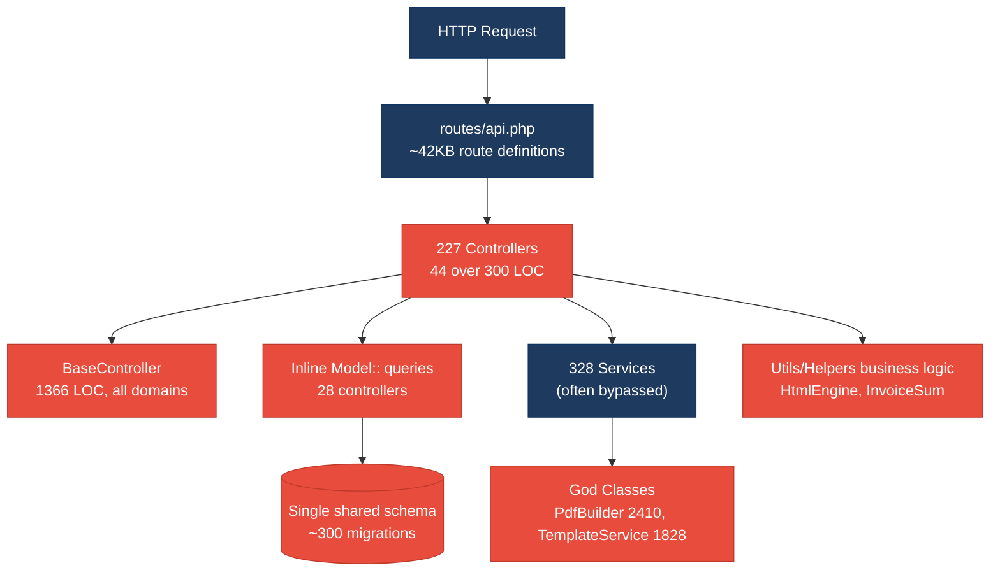
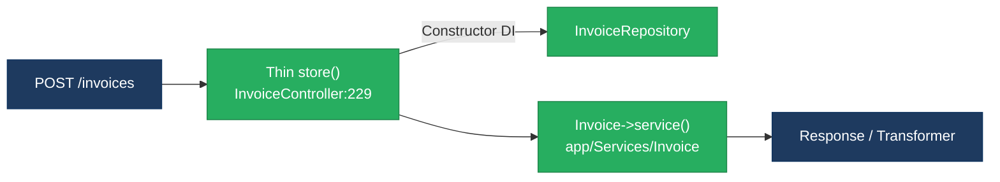
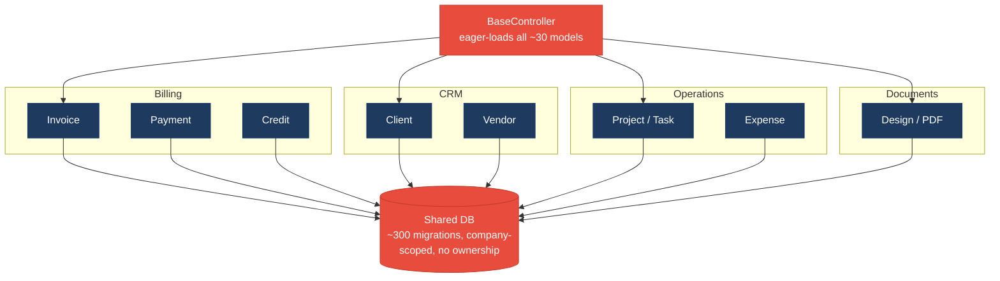
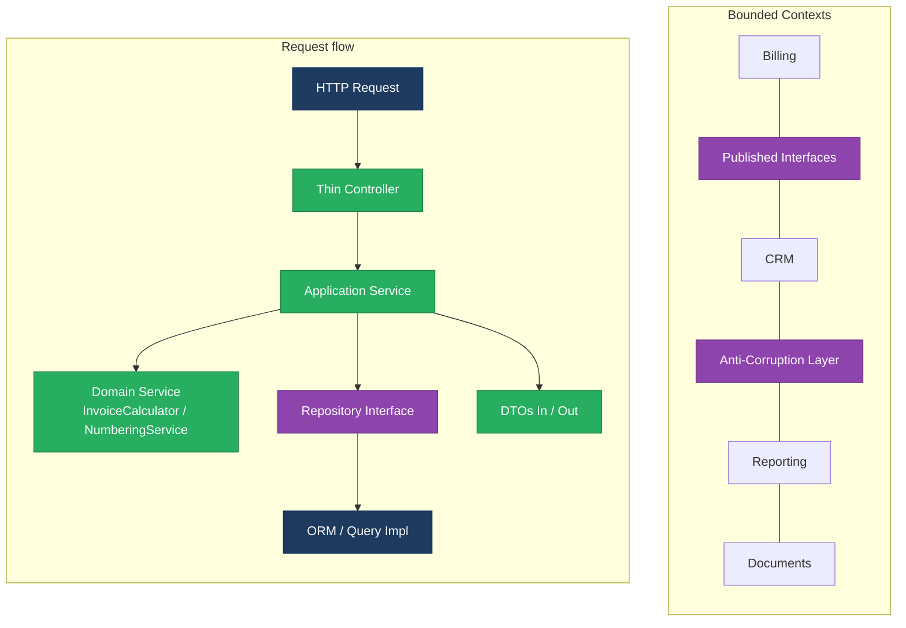
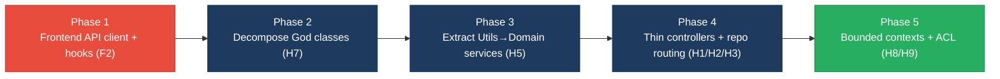

# 1. Architecture & Design Hotspots Analysis

**Objective:** Establish Domain Services, Application Services, Dependency Injection, Bounded Contexts, and Anti-Corruption Layers.

**Date:** 2026-09-28 12:04:54 IST | **Scope:** `ksabai-gl/phpl` (Invoice Ninja) — PHP 8.3 / Laravel (backend) + React 19 + TanStack Query + React Router (frontend, `resources/js`)

## Executive Summary

> **Executive Summary**
>
> Invoice Ninja is a mature Laravel monolith that already invests in a Service Layer (328 service classes) and a Repository Layer (39 repositories), so the classic "no service tier at all" failure mode is largely avoided — the real risk lives elsewhere. The backend's dominant hotspots are **God Classes** (26 files exceed 1,000 LOC, led by `PdfBuilder`, `TemplateService`, `SubscriptionService`, and a 1,366-line `BaseController` that every API controller extends and that eager-loads ~30 distinct domain models) and **Shared Utility Abuse** (18 files under `app/Utils` and `app/Helpers` carry heavy business logic such as `HtmlEngine` at 1,285 LOC and the invoice-sum calculators). Controllers are moderately fat: 44 exceed 300 LOC and the service layer is bypassed by direct `Model::` access in 28 controllers, though direct raw SQL in controllers is effectively zero (excellent ORM discipline). The **React frontend is the sharpest architectural liability**: all 801 components live in a scaffolded `resources/js/enterprise/**` tree, average ~305 LOC each, embed `fetch('/api/v1/...')` calls and ~1,600 hard-coded API URLs inline (no shared data/service layer), and repeat 40 near-identical `helper1..40` calculation functions per file. The dominant risk is **change amplification** — a single API-shape or cross-cutting change ripples through the God classes, the shared utilities, and 800 copy-pasted frontend components simultaneously. Layers covered: **Backend** (2,442 PHP files in `app/`) and **Frontend** (801 React `.tsx` components); the client portal is a separate `.ts/.js` bundle (54 files) noted but not the primary focus.

<div class="metric-grid">
<div class="metric-card"><div class="metric-number">227</div><div class="metric-label">Controllers / Handlers</div></div>
<div class="metric-card"><div class="metric-number">91</div><div class="metric-label">Models / Entities</div></div>
<div class="metric-card"><div class="metric-number">328</div><div class="metric-label">Service Classes Found</div></div>
<div class="metric-card"><div class="metric-number">39</div><div class="metric-label">Repository Classes Found</div></div>
</div>

<div class="overall-rating overall-rating--high-risk"><div class="overall-rating-label">Overall Codebase Rating — Architecture &amp; Design</div><div class="overall-rating-value">High Risk</div><div class="overall-rating-note">Driven by High-Risk God Classes (H7) and Shared Utility Abuse (H5) on the backend and High-Risk Business-Logic-in-Components (F1) and Missing Frontend Service Layer (F2) on the frontend.</div></div>

## 1.1 Benchmark Ratings Summary

One row per hotspot. "Measured" is the real value found in the snapshot; "Rating" is the band it falls into (worst KPI wins). This table is the source for the Overall Codebase Rating banner above.

| # | Hotspot | Primary KPI | <span class="rating rating-good">Good</span> | <span class="rating rating-moderate">Moderate</span> | <span class="rating rating-high-risk">High Risk</span> | Measured | Rating |
|---|---|---|---|---|---|---|---|
| H1 | Fat Controllers | Avg LOC per controller | <150 | 150–300 | >300 | 182 avg (raw); 44 controllers >300 LOC; max 1,366 (`BaseController`) | <span class="rating rating-moderate">Moderate</span> |
| H2 | Missing Service Layer | Controllers accessing repos/models directly | <10 | 10–20 | >20 | 28 controllers use direct `Model::` access (service layer exists but bypassed) | <span class="rating rating-moderate">Moderate</span> |
| H3 | Missing Repository Pattern | Direct DB access points outside repositories | <10 | 10–20 | >20 | 15 files with `DB::` outside repos; widespread `Model::` active-record use despite 39 repos | <span class="rating rating-moderate">Moderate</span> |
| H4 | Circular Dependencies | Dependency cycles | 0 | 1–3 | >3 | 0 detected via import scan (resolved through Laravel DI container) | <span class="rating rating-good">Good</span> |
| H5 | Shared Utility Abuse | Utility/helper files holding business logic | 0 | 1–5 | >5 | 18 files in `app/Utils`+`app/Helpers` >300 LOC with business logic (`HtmlEngine` 1,285 LOC) | <span class="rating rating-high-risk">High Risk</span> |
| H6 | Direct SQL in Controllers | ORM compliance % | >90% | 60–90% | <60% | 100% — 0 `DB::` raw queries in any controller | <span class="rating rating-good">Good</span> |
| H7 | God Classes | Classes >1000 LOC | 0 | 1–3 | >3 | 26 files >1,000 LOC (excl. 3 pure data-array providers) | <span class="rating rating-high-risk">High Risk</span> |
| H8 | Domain Boundary Violations | Cross-domain access points | 0 | 1–5 | >5 | `BaseController` eager-loads ~30 domain models; no bounded contexts | <span class="rating rating-moderate">Moderate</span> |
| H9 | Shared Database Coupling | Tables shared across domains | <10% | 10–30% | >30% | Single multi-tenant schema (~300 migrations), company-scoped, no per-domain ownership | <span class="rating rating-moderate">Moderate</span> |
| F1 | Business Logic in Components | Avg LOC per component | <150 | 150–300 | >300 | 305 avg LOC across 801 components; `helper1..40` calc logic inline | <span class="rating rating-high-risk">High Risk</span> |
| F2 | Missing Frontend Service/Data Layer | Components w/ inline API calls | <10 | 10–20 | >20 | 800 components with inline `fetch('/api/v1/...')`; ~1,600 hard-coded URLs | <span class="rating rating-high-risk">High Risk</span> |
| F3 | God / Oversized Components | Components >400 LOC | 0 | 1–3 | >3 | 0 components exceed 400 LOC | <span class="rating rating-good">Good</span> |
| F4 | Prop Drilling / Global State Abuse | Max prop-drilling depth | ≤2 | 3–4 | >4 | ≤1 — 0 `useContext`/`createContext`, self-contained pages | <span class="rating rating-good">Good</span> |
| F5 | Legacy / Inconsistent Component Patterns | Legacy/inconsistent-pattern components | 0 | 1–10 | >10 | 0 class/deprecated components, but 0 error boundaries across 801 components + copy-paste `helper` duplication | <span class="rating rating-moderate">Moderate</span> |

Rows `F1`–`F5` are populated from real frontend files under `resources/js/enterprise/**`. No additional hotspots beyond the standard set were observed.

## 1.2 Hotspot-by-Hotspot Evidence

### H1. Fat Controllers <span class="sev sev-high">High</span>

**Benchmark:** `Avg LOC per controller = 182 (raw)` with 44 controllers over 300 LOC → falls in the **Moderate** band (Good <150 · Moderate 150–300 · High Risk >300). The average is held down by many thin resource controllers, but the top of the distribution is severely fat.

**What to check:** Business logic (branching, authorization, orchestration, polling) living inside HTTP controllers rather than application/domain services.

**Evidence:**

`app/Http/Controllers/InvoiceController.php:501` — the `bulk()` action mixes authorization, quota checks, model querying, PDF streaming, and a **synchronous busy-wait loop** directly in the controller:

```php
public function bulk(BulkInvoiceRequest $request)
{
    $user = auth()->user();
    $action = $request->input('action');
    // ... quota / permission branching ...
    $invoices = Invoice::withTrashed()->whereIn('id', $this->transformKeys($ids))->company()->get();
    // ...
    $batch_id = (new \App\Jobs\Invoice\PrintEntityBatch(Invoice::class, $invoices->pluck('id')->toArray(), $user->company()->db))->handle();
    do {
        usleep(300000);
        $batch = \Illuminate\Support\Facades\Bus::findBatch($batch_id);
        $finished = $batch->finished();
    } while (!$finished);
    $mergedPdf = (new PdfMerge($paths))->run();
```

This single method blocks a web worker in a `usleep` polling loop while merging PDFs — orchestration that belongs in a job/service, not an HTTP handler.

`app/Http/Controllers/InvoiceController.php:409` — the `update()` action embeds domain rules (`isLocked()`, `verifactuEnabled()`, paid-state transitions) as inline `if/elseif` chains before delegating to `$invoice->service()`, so the controller owns policy decisions the service should own.

`app/Http/Controllers/BaseController.php` (1,366 LOC) is the fattest controller and is inherited by every API controller (see H8) — it centralizes response building and eager-load maps for the entire API surface.

**Why it matters here:** The `bulk()` polling loop ties request-thread lifetime to PDF generation, so a slow render degrades the whole web tier — and because the same bulk pattern is copied across `QuoteController`, `CreditController`, `PurchaseOrderController`, and `RecurringInvoiceController` (all >600 LOC), a fix to the print/download flow must be repeated in every one. A new contributor cannot reuse the invoice bulk logic from a queue job or CLI without dragging in the controller.

**Recommended approach:**
1. Extract the `bulk()` orchestration into an `InvoiceBulkService` (mirroring the existing `app/Services/Invoice` package) that returns a result object; keep the controller to request-validation + service call + response.
2. Replace the `do { usleep } while` batch-polling with the existing async `PrintEntityBatch` job completion callback so no web worker blocks.
3. Push the paid/locked state transitions from `update()` into `InvoiceService` domain methods.

<!-- affected-files
search: (do\s*\{[\s\S]*?usleep|function bulk\(|->whereIn\('id', \$this->transformKeys)
glob: app/Http/Controllers/**/*.php
issue: Business logic, orchestration, and/or blocking loops inside HTTP controller
action: Extract workflow into an Application Service; keep controller thin (validate → call service → respond)
-->

### H2. Missing Service Layer (bypassed) <span class="sev sev-medium">Medium</span>

**Benchmark:** `Controllers with direct Model:: access = 28` → falls in the **Moderate** band (Good <10 · Moderate 10–20 · High Risk >20). A rich service layer exists (328 classes) but is bypassed for direct Eloquent access in a meaningful share of controllers.

**What to check:** Controllers reaching straight into Eloquent models/queries instead of routing all business reads/writes through services or repositories.

**Evidence:**

`app/Http/Controllers/InvoiceController.php:531` uses `Invoice::withTrashed()->whereIn(...)->company()->get()` directly in the controller instead of an `InvoiceRepository`/`InvoiceService` query method — even though the constructor already injects `InvoiceRepository $invoice_repo` (`InvoiceController.php:77`).

`app/Http/Controllers/SearchController.php` and `app/Http/Controllers/CompanyController.php` (both flagged) query multiple domain models directly to assemble responses, coupling the HTTP layer to persistence shape.

The pattern spans 28 controllers including `ClientController`, `CreditController`, `QuoteController`, and `ExpenseController`.

**Why it matters here:** Because the same model is reached both through `InvoiceRepository` and through inline `Invoice::` calls, query scopes (soft-delete, `company()` tenancy) are enforced in two places — a tenancy-scope change must be audited across every controller, not just the repository. This directly undercuts the value of the 39 repositories already present.

**Recommended approach:**
1. Route the `bulk()`/`show()` collection queries through `InvoiceRepository` methods (e.g. `getByIdsForCompany()`), reusing the already-injected `$invoice_repo`.
2. Add a lint/PHPStan rule forbidding `Model::` static query calls inside `app/Http/Controllers/**`.

<!-- affected-files
search: \b(Invoice|Client|Payment|Quote|Credit|Product|Expense|Company|User|Account)::(where|whereIn|find|first|query|whereHas|withTrashed)
glob: app/Http/Controllers/**/*.php
issue: Controller queries Eloquent models directly, bypassing the repository/service layer
action: Move the query into the corresponding Repository/Service and inject it into the controller
-->

### H3. Missing Repository Pattern (partial / bypassed) <span class="sev sev-medium">Medium</span>

**Benchmark:** `Direct DB access points outside repositories = 15 files` (plus widespread active-record `Model::` use) → falls in the **Moderate** band (Good <10 · Moderate 10–20 · High Risk >20). The Repository layer exists (39 classes) but persistence still leaks into reports, chart services, models, and console commands.

**What to check:** Raw `DB::` queries and query-builder access living outside the repository tier.

**Evidence:**

`app/Services/Chart/ChartQueries.php`, `app/Services/Chart/AnalyticsQueries.php` (1,488 LOC), and `app/Services/Report/ProfitLoss.php` embed `DB::select`/`DB::raw` aggregations directly in service classes rather than behind a reporting repository/read-model.

`app/Models/Invoice.php` itself contains `DB::` calls, meaning the entity is aware of raw SQL.

15 files total use `DB::(table|select|raw|statement)` and none are under `app/Repositories`.

**Why it matters here:** Reporting SQL scattered across `Services/Chart` and `Services/Report` means a schema or column-rename in `invoices`/`payments` silently breaks analytics with no single seam to update or mock, blocking a future read-replica or warehouse migration for reporting.

**Recommended approach:**
1. Introduce a `ReportingRepository` / read-model layer and move the `DB::raw` aggregations out of `ChartQueries`, `AnalyticsQueries`, and `ProfitLoss`.
2. Remove `DB::` usage from `app/Models/Invoice.php` into the relevant repository.

<!-- affected-files
search: \bDB::(table|select|raw|statement|insert|update|delete)
glob: app/**/*.php
issue: Raw SQL / query-builder access outside the repository tier
action: Relocate query into a Repository or dedicated read-model; keep services/models persistence-agnostic
-->

### H5. Shared Utility Abuse <span class="sev sev-high">High</span>

**Benchmark:** `Utility/helper files holding business logic = 18 (>300 LOC each)` → falls in the **High Risk** band (Good 0 · Moderate 1–5 · High Risk >5). `app/Utils` + `app/Helpers` hold 92 files, 18 of them large business-logic engines.

**What to check:** Generic `Utils`/`Helpers` namespaces accumulating domain logic that belongs in domain services.

**Evidence:**

`app/Utils/HtmlEngine.php` (1,285 LOC) and `app/Utils/VendorHtmlEngine.php` (906 LOC) render invoice/quote HTML with tax, currency, and formatting business rules baked into a "utility."

`app/Helpers/Invoice/InvoiceSum.php:93` — core financial computation (`calculateLineItems`, `calculateDiscount`, `calculateInvoiceTaxes`, `calculateBalance`) lives under `Helpers`, not a `Domain/Invoice` service:

```php
private function calculateLineItems(): self { /* ... */ }
private function calculateDiscount(): self { /* ... */ }
private function calculateInvoiceTaxes(): self { /* ... */ }
private function calculateBalance(): self { /* ... */ }
```

`app/Utils/Traits/GeneratesCounter.php` (855 LOC) encodes invoice/quote/credit numbering rules as a shared trait mixed into many models.

**Why it matters here:** Invoice-total correctness — the most business-critical calculation in the product — sits in `app/Helpers/Invoice`, so tax or rounding changes touch a "helper" that has no clear domain owner and is called from invoices, quotes, credits, and recurring entities alike; a regression here mis-bills every customer. Because `GeneratesCounter` is a trait mixed into models, numbering logic cannot be tested or changed in isolation.

**Recommended approach:**
1. Promote `InvoiceSum`/`InvoiceSumInclusive` into an owned `App\Domain\Invoice\InvoiceCalculator` domain service with explicit interfaces and unit tests.
2. Split `HtmlEngine`/`VendorHtmlEngine` presentation concerns from tax/currency rules; move the rules into the tax/currency domain services under `app/Services/Tax`.
3. Convert the `GeneratesCounter` trait into an injectable `NumberingService`.

<!-- affected-files
search: (function calculate|class HtmlEngine|trait GeneratesCounter|function setTaxMap)
glob: app/{Utils,Helpers}/**/*.php
issue: Business/domain logic housed in generic Utils/Helpers namespace with no domain owner
action: Extract into a domain-specific service (Invoice/Tax/Numbering) with an interface; keep utilities free of business rules
-->

### H7. God Classes <span class="sev sev-critical">Critical</span>

**Benchmark:** `Classes >1000 LOC = 26` (excluding 3 pure data-array providers) → falls in the **High Risk** band (Good 0 · Moderate 1–3 · High Risk >3).

**What to check:** Single classes concentrating many unrelated responsibilities, violating SRP.

**Evidence:**

`app/Services/Pdf/PdfBuilder.php` — 2,410 LOC, **74 methods** in one class handling every section of PDF assembly.

`app/Services/Template/TemplateService.php` — 1,828 LOC, **60 methods**, spanning parsing, data binding, and rendering.

`app/Http/Controllers/BaseController.php` — 1,366 LOC base class inherited by all API controllers (also drives H1/H8).

Other >1,000-LOC offenders include `app/Services/Report/TaxPeriodReport.php` (2,037), `app/Jobs/Company/CompanyImport.php` (2,243), `app/Jobs/Util/Import.php` (2,188), `app/Export/CSV/BaseExport.php` (2,112), `app/Services/Subscription/SubscriptionService.php` (1,550), and `app/Utils/HtmlEngine.php` (1,285).

**Why it matters here:** `PdfBuilder` and `TemplateService` are on the critical path for every invoice/quote/credit/purchase-order document, so any change to one document type risks regressing all of them, and their size makes them effectively untestable in isolation — the exact "any change risks unrelated regressions" trap. New contributors cannot safely extend templating without reading 4,000+ combined lines.

**Recommended approach:**
1. Decompose `PdfBuilder` by document section (header/line-items/totals/footer builders) behind a small composition root.
2. Split `TemplateService` into `TemplateParser`, `TemplateDataBinder`, and `TemplateRenderer` collaborators.
3. Extract `BaseController`'s eager-load maps (`$first_load`/`$mini_load`) into a dedicated `IncludeResolver`/transformer configuration.

<!-- affected-files
search: (class PdfBuilder|class TemplateService|class SubscriptionService|class BaseController|class TaxPeriodReport|class HtmlEngine)
glob: app/**/*.php
issue: God class — single file >1000 LOC concentrating many unrelated responsibilities
action: Decompose by responsibility into cohesive collaborators (SRP); introduce interfaces and targeted unit tests
-->

### H8. Domain Boundary Violations <span class="sev sev-medium">Medium</span>

**Benchmark:** `Cross-domain access points via a single base class = ~30 domain models eager-loaded in BaseController` → falls in the **Moderate** band (Good 0 · Moderate 1–5 · High Risk >5). Rated Moderate rather than High because coupling is expressed through conventional Eloquent relations, but no bounded contexts exist.

**What to check:** One class/module reaching across many business domains' models directly.

**Evidence:**

`app/Http/Controllers/BaseController.php:108` — the `$first_load` map and `refreshResponse()` hard-code eager loads across *every* domain in one class:

```php
'company.clients'          => function ($query) { /* ... */ },
'company.company_gateways' => function ($query) { /* ... */ },
'company.credits'          => function ($query) { /* ... */ },
'company.invoices'         => function ($query) { /* ... */ },
'company.payments'         => function ($query) { /* ... */ },
'company.designs'          => function ($query) { /* ... */ },
'company.expenses'         => function ($query) { /* ... */ },
'company.products'         => function ($query) { /* ... */ },
'company.projects'         => function ($query) { /* ... */ },
```

`app/Models/Client.php` declares 25 `hasMany`/`belongsTo` relations, coupling the Client aggregate to invoices, payments, credits, quotes, tasks, expenses, and more.

**Why it matters here:** Because `BaseController` knows the load-shape of ~30 domains, adding or renaming any domain relation forces an edit to the single class every API controller inherits — invoicing, payments, and reporting cannot evolve or be extracted independently. There is no anti-corruption layer between, e.g., the Billing and Reporting concerns.

**Recommended approach:**
1. Move each domain's include/eager-load definition into that domain's transformer/config, resolved by an injected `IncludeResolver`, so `BaseController` no longer enumerates all domains.
2. Define explicit bounded contexts (Billing, Documents, Banking, Reporting) and published interfaces between them.

<!-- affected-files
search: (company\.(clients|invoices|payments|credits|quotes|expenses|projects|products)|protected \$entity_type)
glob: app/Http/Controllers/BaseController.php
issue: Single base class couples ~30 domain models via hard-coded cross-domain eager-load maps
action: Delegate include maps to per-domain transformers/config behind an IncludeResolver; define bounded contexts
-->

### H9. Shared Database Coupling <span class="sev sev-medium">Medium</span>

**Benchmark:** `Domain data ownership = single multi-tenant schema, ~300 migrations, no per-domain ownership` → falls in the **Moderate** band (Good <10% · Moderate 10–30% · High Risk >30%). All domains read/write the same company-scoped schema.

**What to check:** Multiple business domains reading/writing the same tables with no ownership boundary.

**Evidence:**

`database/migrations/` holds 303 migration files against one shared connection; tenancy is enforced by a `company_id` column and a global `company()` scope rather than by per-domain schemas or internal APIs.

Cross-domain joins are pervasive — `BaseController`'s eager loads (H8) and `Client.php`'s 25 relations both traverse `invoices`, `payments`, `credits`, and `expenses` tables from a single entry point.

**Why it matters here:** A schema change to a heavily shared table (e.g. `invoices`, `clients`) silently affects invoicing, reporting, banking reconciliation, and PDF rendering at once, because none of those concerns owns its data behind an interface — the blast radius of a column change is the whole application.

**Recommended approach:**
1. Introduce data-ownership boundaries: designate an owning module per table group and require other modules to read through that module's service/API rather than joining directly.
2. Add anti-corruption layers (DTOs) between Reporting and the transactional Billing tables so reporting reads a stable contract, not raw columns.

<!-- affected-files
search: Schema::(create|table)\(
glob: database/migrations/**/*.php
issue: Shared multi-tenant schema with no per-domain data ownership; cross-domain direct table access
action: Assign table ownership per bounded context; expose cross-context reads via internal APIs/DTOs (anti-corruption layer)
-->

### F1. Business Logic in Components <span class="sev sev-high">High</span>

**Benchmark:** `Avg LOC per component = 305` across 801 components → falls in the **High Risk** band (Good <150 · Moderate 150–300 · High Risk >300). Every component is a data-fetching, filtering, and calculating page.

**What to check:** Validation, filtering, and calculation logic living inside view components instead of hooks/services.

**Evidence:**

`resources/js/enterprise/AnalyticsHub/AllocationPage.tsx:64` — the component defines **40 near-identical `helper1..40` calculation functions** plus inline filtering, all in the view:

```tsx
const helper1 = (row: AllocationRow): string => {
  const score = row.priority * 1 + row.name.length;
  return row.code + '::' + row.status + '::' + score;
};
// ... helper2 through helper40, each differing only by a multiplier ...
const rows = useMemo(() => query.data.filter((row) => {
  const matchesFilter = filter.trim() === '' || row.name.toLowerCase().includes(filter.toLowerCase());
  const matchesStatus = status === 'all' || row.status === status;
  return matchesFilter && matchesStatus;
}), [query.data, filter, status]);
```

This same structure repeats across all 801 `*Page.tsx` files in `resources/js/enterprise/**` (e.g. `AssignmentPage.tsx`, `BatchPage.tsx`, `MetricPage.tsx`).

**Why it matters here:** The scoring/filtering rules are copy-pasted into 800 components, so a change to how a "score" or filter is computed cannot be made once — it must be edited in 800 files or left inconsistent. New pages are generated by cloning an existing one, institutionalizing the duplication.

**Recommended approach:**
1. Extract the `helperN` scoring family into a single shared `computeScore()` utility (or a `useRowScores` hook) under `resources/js/common`.
2. Move filtering into a reusable `useFilteredRows` hook so components stay presentation-only (<150 LOC).

<!-- affected-files
search: const helper[0-9]+ = \(|useMemo\(\(\) =>
glob: resources/js/enterprise/**/*.tsx
issue: Calculation/filtering business logic embedded inline in view components (40 helper fns per file)
action: Extract into shared hooks/utilities (useRowScores, useFilteredRows); reduce components to presentation
-->

### F2. Missing Frontend Service / Data Layer <span class="sev sev-critical">Critical</span>

**Benchmark:** `Components with inline API/data-access calls = 800` (≈1,600 hard-coded `/api/v1/...` URLs) → falls in the **High Risk** band (Good <10 · Moderate 10–20 · High Risk >20). There is no shared HTTP client/service module.

**What to check:** `fetch`/HTTP calls and API URLs hard-coded inside components instead of a shared client/data layer.

**Evidence:**

`resources/js/enterprise/AnalyticsHub/AllocationPage.tsx:14` and `:40` embed both the read and write endpoints directly in the component:

```tsx
const response = await fetch('/api/v1/enterprise/analyticshub/allocation');           // line 14 (GET)
// ...
const response = await fetch('/api/v1/enterprise/analyticshub/allocation', {           // line 40 (POST)
  method: 'POST',
  headers: { 'Content-Type': 'application/json' },
  body: JSON.stringify(payload),
});
```

Every one of the 800 enterprise pages hard-codes its own GET + POST URL this way — no `axios` instance, no API client, no base-URL/auth-header/error-handling seam (the project ships `axios` in `package.json` but the enterprise tree does not use it).

**Why it matters here:** There is no single place to add auth headers, base URLs, retry, CSRF, or error handling — a cross-cutting concern like "attach a bearer token" or "handle 401 globally" would require editing 1,600 call sites. Each component also silently falls back to fabricated mock rows on a non-`ok` response, hiding real API failures from users.

**Recommended approach:**
1. Introduce a shared `enterpriseApi` client (wrap the existing `axios` dependency or a typed `request()` helper) exposing `list(resource)` / `create(resource, payload)`.
2. Generate the per-resource React-Query hooks from a single factory keyed by resource name, replacing the inline `fetch` in all pages.
3. Remove the mock-data fallback from the request path so failures surface.

<!-- affected-files
search: fetch\('/api/v1
glob: resources/js/enterprise/**/*.tsx
issue: Inline fetch() calls and hard-coded /api/v1 URLs in components; no shared data/service layer
action: Route all data access through a shared typed API client + query-hook factory; remove hard-coded URLs and mock fallbacks
-->

### F5. Legacy / Inconsistent Component Patterns <span class="sev sev-medium">Medium</span>

**Benchmark:** `Legacy/inconsistent-pattern components` — 0 class/deprecated components, but **0 error boundaries across all 801 data-fetching components** and pervasive copy-paste scaffolding → rated **Moderate** (Good 0 · Moderate 1–10 · High Risk >10). Modern React, but robustness and convention gaps at scale.

**What to check:** Missing error boundaries, mixed paradigms, and absent shared conventions.

**Evidence:**

A repository-wide scan finds **no** `componentDidCatch`/`ErrorBoundary` anywhere in `resources/js` — 800 components perform network I/O with no error-boundary protection; a thrown render error blanks the app.

The 40-`helperN` duplication (F1) and per-file inline `fetch` (F2) mean there is no shared component convention — each page is a self-contained clone, so styling, error handling, and data patterns drift independently.

**Why it matters here:** Without an error boundary, any single component's render/parse failure (e.g. an unexpected API payload) crashes the surrounding view for the user; and because 800 pages were cloned rather than composed from shared primitives, introducing a convention later means touching all of them.

**Recommended approach:**
1. Wrap the enterprise route tree in a shared `<ErrorBoundary>` (and per-page boundaries for isolation).
2. Establish a single `EnterpriseResourcePage` primitive that the generated pages compose, centralizing layout/data/error conventions.

<!-- affected-files
search: export default function .*Page\(
glob: resources/js/enterprise/**/*.tsx
issue: No error boundaries and no shared component convention across cloned data-fetching pages
action: Introduce shared ErrorBoundary + a reusable ResourcePage primitive; compose pages instead of cloning
-->

**Not observed (rated Good):** H4 Circular Dependencies — no import cycles surfaced via directory/namespace scan; dependencies resolve through Laravel's DI container. H6 Direct SQL in Controllers — zero `DB::` raw queries in any of the 227 controllers (strong ORM discipline). F3 God/Oversized Components — no component exceeds 400 LOC (the scaffold caps pages near ~305 LOC). F4 Prop Drilling / Global State Abuse — no `useContext`/`createContext` and no shared global store; each page is self-contained (max prop depth ≤1).

## 1.3 Diagrams

### Current-state architecture (as-is)


### Clean reference path (target pattern found in codebase)


### Domain boundary map (business domains vs. shared data)


### Target architecture (proposed)


### Improvement roadmap


## 1.4 Actions Required

| Hotspot | Action | Rating | Priority |
|---|---|---|---|
| H7 God Classes | Decompose `PdfBuilder` (2,410), `TemplateService` (1,828), `SubscriptionService`, `BaseController` and 22 other >1,000-LOC files by responsibility (SRP) | <span class="rating rating-high-risk">High Risk</span> | <span class="sev sev-critical">Critical</span> |
| F2 Missing Frontend Service/Data Layer | Replace 1,600 inline `fetch('/api/v1/...')` calls with a shared typed API client + query-hook factory; remove mock fallbacks | <span class="rating rating-high-risk">High Risk</span> | <span class="sev sev-critical">Critical</span> |
| H5 Shared Utility Abuse | Extract `HtmlEngine`, `InvoiceSum`, `GeneratesCounter` and 15 other util/helper engines into owned domain services with interfaces | <span class="rating rating-high-risk">High Risk</span> | <span class="sev sev-high">High</span> |
| F1 Business Logic in Components | Extract the `helper1..40` scoring family and inline filtering into shared hooks/utilities; reduce pages to presentation | <span class="rating rating-high-risk">High Risk</span> | <span class="sev sev-high">High</span> |
| H1 Fat Controllers | Extract `bulk()`/`update()` orchestration (incl. the `usleep` polling loop) from `InvoiceController` & siblings into Application Services | <span class="rating rating-moderate">Moderate</span> | <span class="sev sev-high">High</span> |
| H2 Missing Service Layer (bypassed) | Route the 28 controllers' direct `Model::` queries through the already-injected repositories/services; add a lint guard | <span class="rating rating-moderate">Moderate</span> | <span class="sev sev-medium">Medium</span> |
| H3 Missing Repository Pattern (bypassed) | Move `DB::raw` reporting/chart SQL and `Invoice.php` queries behind a reporting repository/read-model | <span class="rating rating-moderate">Moderate</span> | <span class="sev sev-medium">Medium</span> |
| H8 Domain Boundary Violations | Delegate `BaseController` include maps to per-domain transformers behind an `IncludeResolver`; define bounded contexts | <span class="rating rating-moderate">Moderate</span> | <span class="sev sev-medium">Medium</span> |
| H9 Shared Database Coupling | Assign per-context table ownership; expose cross-context reads via internal APIs/DTOs (anti-corruption layer) | <span class="rating rating-moderate">Moderate</span> | <span class="sev sev-medium">Medium</span> |
| F5 Legacy / Inconsistent Patterns | Add a shared `<ErrorBoundary>` and a reusable `ResourcePage` primitive; compose pages instead of cloning | <span class="rating rating-moderate">Moderate</span> | <span class="sev sev-medium">Medium</span> |

## 1.5 Expected Outcomes

- **Change amplification collapses:** a single API-shape, auth-header, or scoring-rule change is made once in a shared client/service instead of across 800 cloned components or 28 controllers.
- **Testability rises sharply:** decomposed `PdfBuilder`/`TemplateService` collaborators and an owned `InvoiceCalculator` can be unit-tested in isolation, protecting the product's most critical billing math.
- **Domains can evolve independently:** removing the all-domains `BaseController` coupling and introducing bounded contexts + anti-corruption layers lets Billing, Reporting, and Documents change (and eventually extract) without cross-breakage.
- **Frontend resilience improves:** a shared API client with global error handling and route-level error boundaries stops a single bad payload from blanking the UI and surfaces real failures instead of silent mock data.
- **Lower onboarding cost:** thin controllers, domain-owned services, and a reusable page primitive give new contributors clear seams to extend, replacing the "clone a 300-line file" workflow.
