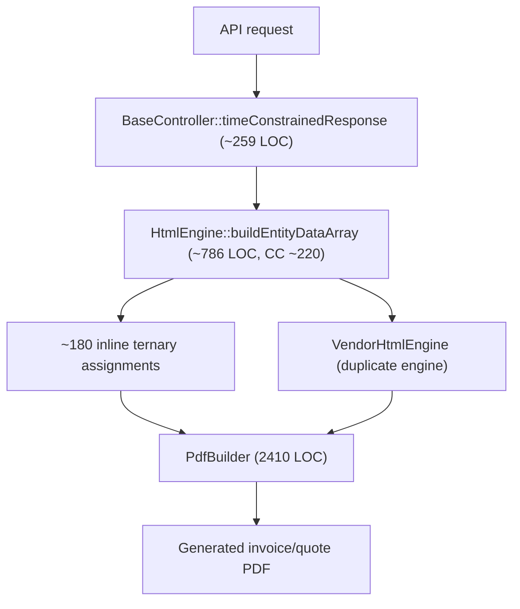
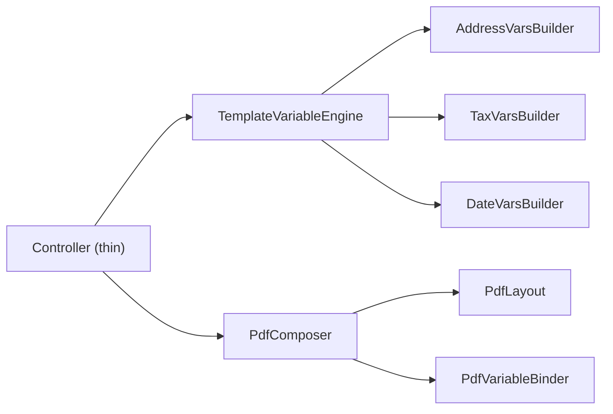

# 2. Code Quality & Complexity Hotspots Analysis

**Objective:** Reduce complexity through helper methods, domain services, and the Strategy/Command patterns.

**Date:** 2026-09-29 11:19:11 IST | **Scope:** `ksabai-gl/phpl` (Invoice Ninja) — Laravel 11 (PHP 8.x) backend + React 18 / TypeScript (`@tanstack/react-query`) frontend

## Executive Summary

> **Executive Summary**
>
> Code-quality health is **High Risk**, driven by three compounding problems. First, **oversized units**: 26 backend files exceed 1,000 LOC (led by `PdfBuilder` at 2,410 and `TemplateService` at 1,828) and at least 31 methods exceed 200 LOC — the worst being `HtmlEngine::buildEntityDataArray()` at ~786 LOC, a single method that assembles hundreds of template variables with an inline ternary on nearly every line (effective cyclomatic complexity ~220, ~40 branch statements even excluding ternaries). Second, **catastrophic duplication in the frontend**: the *entire* committed React tree is a generated scaffold — 801 near-identical `*.tsx` pages (all exactly 305 LOC) plus 800 identical 404-line test files, 567,224 LOC in total, produced by `tools/generate_enterprise_modules.php`, whose own header states it exists "to expand LOC footprint." Each page repeats 40 copy-pasted `helper1..40` scoring functions that differ only by a magic multiplier, and embeds two inline `fetch('/api/v1/...')` calls with mock-data fallbacks. Third, **backend duplication** appears in parallel engines (`HtmlEngine` vs `VendorHtmlEngine`) and mirrored services (`Invoice/UpdateReminder` vs `Quote/UpdateReminder`). Layers covered: **Backend** — 2,442 PHP files in `app/` (excluding 4 pure data-array providers such as `SMSNumbers.php`); **Frontend** — 1,601 generated files under `resources/js/enterprise/**` (801 components + 800 test suites). Churn, defect-density, and ownership metrics (H6–H8) could **not** be measured: the snapshot is a shallow clone with only 10 commits, a single author, and no fix/bug commits — those hotspots are marked *n/a* and their weight is redistributed in the Hotspot Score.

<div class="metric-grid">
<div class="metric-card"><div class="metric-number">4,043</div><div class="metric-label">Files Analyzed</div></div>
<div class="metric-card"><div class="metric-number">31</div><div class="metric-label">Functions/Methods Over 200 LOC</div></div>
<div class="metric-card"><div class="metric-number">26</div><div class="metric-label">Classes/Files Over 1000 LOC</div></div>
<div class="metric-card"><div class="metric-number">~220</div><div class="metric-label">Highest Cyclomatic Complexity</div></div>
</div>

<div class="overall-rating overall-rating--high-risk"><div class="overall-rating-label">Overall Codebase Rating — Code Quality &amp; Complexity</div><div class="overall-rating-value">High Risk</div><div class="overall-rating-note">Driven by High-Risk Large Classes (H2), Large Functions (H3), Cyclomatic Complexity (H1), and near-total Duplication (H4/H5) from the generated frontend scaffold and its LOC-padding boilerplate (H9).</div></div>

<div class="hotspot-score hotspot-score--high-risk"><div class="hotspot-score-label">Hotspot Score (weighted composite)</div><div class="hotspot-score-value">87 / 100 — High Risk</div><div class="hotspot-score-formula">Hotspot Score = (Cyclomatic Complexity × 25%) + (Code Churn × 25% → n/a) + (Defect Density × 20% → n/a) + (Class/Function Size × 15%) + (Business Logic Duplication × 10%) + (Developer Ownership Risk × 5% → n/a); 50% of weight is unmeasurable (shallow clone) so it is redistributed proportionally → Cyclomatic 50%, Size 30%, Duplication 20% = (85×0.50) + (90×0.30) + (85×0.20) = 42.5 + 27.0 + 17.0 = 87</div></div>

## 2.1 Benchmark Ratings Summary

One row per hotspot. "Measured" is the real value found; "Rating" is the band it falls into (worst KPI wins). This table is the source for the Overall Codebase Rating banner above.

| # | Hotspot | Primary KPI | <span class="rating rating-good">Good</span> | <span class="rating rating-moderate">Moderate</span> | <span class="rating rating-high-risk">High Risk</span> | Measured | Rating |
|---|---|---|---|---|---|---|---|
| H1 | High Cyclomatic Complexity | Max complexity per method | <10 | 10–20 | >20 | ~220 (`HtmlEngine::buildEntityDataArray`, ternary-inclusive); ~40 branch-only; several methods >30 | <span class="rating rating-high-risk">High Risk</span> |
| H2 | Large Classes | Largest class LOC | <300 | 300–1000 | >1000 | 2,410 max (`PdfBuilder`); 26 files >1,000 LOC; 259 files >300 LOC | <span class="rating rating-high-risk">High Risk</span> |
| H3 | Large Functions | Largest function LOC | <50 | 50–200 | >200 | ~786 max (`HtmlEngine::buildEntityDataArray`); 31 methods >200 LOC | <span class="rating rating-high-risk">High Risk</span> |
| H4 | Business Logic Duplication | Duplicated business logic % | <5% | 5–10% | >10% | >10% — parallel `HtmlEngine`/`VendorHtmlEngine`, mirrored `Invoice`/`Quote` `UpdateReminder`, 32,000 `helperN` scoring fns | <span class="rating rating-high-risk">High Risk</span> |
| H5 | Duplicate Code (general) | Overall duplicate code % | <5% | 5–10% | >10% | ~60% — 567,224 LOC of near-identical generated frontend (1,601 files from 2 templates) | <span class="rating rating-high-risk">High Risk</span> |
| H6 | High Churn Areas | Monthly changes (top files) | <5 | 5–10 | >10 | n/a — shallow clone (10 commits, recent-only); top file changed 3× | <span class="rating rating-good">n/a</span> |
| H7 | Defect-Prone Files | Fix commits (hottest file) | 1–3 | 4–5 | >5 | n/a — 0 commits matching `fix`/`bug`/`hotfix` in shallow history | <span class="rating rating-good">n/a</span> |
| H8 | Ownership Issues | Top-author ownership % | >80% | 60–80% | <60% | n/a — single author (`ksabai-gl`) across the entire snapshot | <span class="rating rating-good">n/a</span> |
| H9 | Generated Dead / Boilerplate Code *(additional)* | % of code that is generated LOC-padding with no distinct behavior | <5% | 5–15% | >15% | ~60% — `tools/generate_enterprise_modules.php` emits 1,601 files "to expand LOC footprint" | <span class="rating rating-high-risk">High Risk</span> |
| H10 | Magic Numbers & Primitive Obsession *(additional)* | Files whose domain "logic" is bare literals/string concat | <5% | 5–15% | >15% | 800 pages compute scores as `row.priority * <1..40> + row.name.length` and concat `code::status::score` | <span class="rating rating-moderate">Moderate</span> |

**Additional hotspots:** two beyond the standard set were observed — **H9 Generated Dead/Boilerplate Code** (KPI: share of the codebase that is machine-generated LOC-padding with no distinct behavior; >15% = High Risk — this codebase is ~60%) and **H10 Magic Numbers & Primitive Obsession** (KPI: share of files whose "business logic" is bare numeric/string literals; the scaffold's `helperN` scoring is nothing but magic multipliers and string concatenation).

### Hotspot Score breakdown

Churn (H6), Defect Density (H7), and Ownership (H8) are unmeasurable on this shallow, single-author snapshot, so their combined 50% weight is redistributed proportionally across the three measurable components (Cyclomatic 25→50%, Size 15→30%, Duplication 10→20%).

| Component | Weight | Sub-score (0–100) | Weighted |
|---|---|---|---|
| Cyclomatic Complexity | 25% → **50%** | 85 | 42.5 |
| Code Churn | 25% | n/a | — |
| Defect Density | 20% | n/a | — |
| Class/Function Size | 15% → **30%** | 90 | 27.0 |
| Business Logic Duplication | 10% → **20%** | 85 | 17.0 |
| Developer Ownership Risk | 5% | n/a | — |
| **Hotspot Score** | **100%** | | **87 / 100** |

## 2.2 Hotspot-by-Hotspot Evidence

### H1. High Cyclomatic Complexity <span class="sev sev-critical">Critical</span>

**Benchmark:** `Max complexity per method = ~220 (ternary-inclusive), ~40 branch-only` → falls in the **High Risk** band (Good <10 · Moderate 10–20 · High Risk >20).

The single worst method is `HtmlEngine::buildEntityDataArray()` — ~786 LOC that build a template-variable dictionary, with an inline ternary on nearly every line:

```php
// app/Utils/HtmlEngine.php:127
public function buildEntityDataArray(): array
{
    if (! $this->client->currency()) {
        throw new Exception(debug_backtrace()[1]['function'], 1);
    }
    // ...
    $data['$show_shipping_address'] = ['value' => $locationData['shipping_exists'] && $this->settings->show_shipping_address ? 'flex' : 'none', 'label' => ''];
    $data['$show_shipping_address_block'] = ['value' => $locationData['shipping_exists'] && $this->settings->show_shipping_address ? 'block' : 'none', 'label' => ''];
    // ~180 more ternary-laden assignments follow, all in one method
```

`BaseRepository::save()` and `BaseController::timeConstrainedResponse()` are also branch-dense:

```php
// app/Http/Controllers/BaseController.php:707  (~259 LOC, CC ~31)
protected function timeConstrainedResponse($query)
{
    $user = auth()->user();
    if (request()->hasHeader('X-React')) {
        $this->manager->parseIncludes(['account','user.company_user','token','company']);
        request()->merge(['created_at' => time()]);
        // long chain of conditional include/transform branches ...
```

**Why it matters here:** These methods sit on the billing-critical PDF/template and API-response paths. A single method with ~40+ independent branches cannot be exhaustively unit-tested, so template or include-map changes are made "by eye" and regressions surface in customer-facing invoices. High branch density is the strongest predictor of defect injection on edit.

**Recommended approach:** (1) Split `buildEntityDataArray()` into cohesive builders (`buildAddressVars()`, `buildTaxVars()`, `buildDateVars()`) coordinated by a small dispatcher; (2) replace ternary chains with lookup maps / value objects; (3) apply the **Strategy** pattern to `timeConstrainedResponse()` so per-entity include logic lives in per-domain resolvers rather than one branching method.

<!-- affected-files
search: \)\s*\?\s*[^:;]+:
glob: app/**/*.php
issue: High per-method cyclomatic complexity from dense conditional/ternary logic
action: Extract branch families into smaller helpers/Strategy handlers; replace ternary chains with lookup maps
-->

### H2. Large Classes <span class="sev sev-critical">Critical</span>

**Benchmark:** `Largest class LOC = 2,410 (PdfBuilder); 26 files >1,000 LOC` → falls in the **High Risk** band (Good <300 · Moderate 300–1000 · High Risk >1000).

The 26 backend files above 1,000 LOC (data-array providers excluded) concentrate many responsibilities in one class. Representative offenders:

```text
2,410  app/Services/Pdf/PdfBuilder.php
2,243  app/Jobs/Company/CompanyImport.php
2,188  app/Jobs/Util/Import.php
2,112  app/Export/CSV/BaseExport.php
2,037  app/Services/Report/TaxPeriodReport.php
1,828  app/Services/Template/TemplateService.php
1,550  app/Services/Subscription/SubscriptionService.php
1,366  app/Http/Controllers/BaseController.php   ← every API controller extends this
1,285  app/Utils/HtmlEngine.php
1,140  app/Models/Client.php   /   1,140  app/Http/Controllers/InvoiceController.php
```

```php
// app/Services/Pdf/PdfBuilder.php  (2,410 LOC, ~361 decision points in the file)
class PdfBuilder
{
    // layout, sectioning, variable binding, HTML generation and PDF assembly all in one class
```

**Why it matters here:** `BaseController` (1,366 LOC) is inherited by every API controller, so its size and coupling are amplified across the whole HTTP surface. `PdfBuilder` and `TemplateService` are the product's document engine — their size makes the most business-critical code the hardest to change safely.

**Recommended approach:** (1) Decompose `PdfBuilder` by responsibility (layout → `PdfLayout`, variable binding → `PdfVariableBinder`, assembly → `PdfComposer`) under the Single Responsibility Principle; (2) pull shared behavior out of `BaseController` into focused traits/services so controllers stop inheriting 1,366 lines; (3) split `TaxPeriodReport`/`Import` into per-step domain services.

<!-- affected-files
search: ^(final |abstract )?class (PdfBuilder|CompanyImport|Import|BaseExport|TaxPeriodReport|TemplateService|SubscriptionService|BaseController|HtmlEngine|JsonToSectionsAdapter|PdfMock|AnalyticsQueries|Client|Company|InvoiceController|CheckData|CreateSingleAccount|BaseImport|CompanySettings|CalendarConnectionService|HtmlEngine|VendorHtmlEngine)\b
glob: app/**/*.php
issue: Class far exceeds 1,000 LOC and mixes multiple responsibilities
action: Split into domain-focused classes (SRP); extract collaborators behind interfaces
-->

### H3. Large Functions <span class="sev sev-critical">Critical</span>

**Benchmark:** `Largest function LOC = ~786; 31 methods >200 LOC` → falls in the **High Risk** band (Good <50 · Moderate 50–200 · High Risk >200).

The largest single methods (measured by span to the next declaration):

```text
~786  app/Utils/HtmlEngine.php:127            buildEntityDataArray()
~613  app/Jobs/Company/CompanyExport.php:72
~431  app/Utils/VendorHtmlEngine.php:115
~381  app/Console/Commands/CreatePeppolTestData.php:106
~356  app/Services/Pdf/PdfMock.php:254   (three methods >300 in this one file)
~295  app/Repositories/BaseRepository.php:151  save()
~266  app/Http/Controllers/BaseController.php:707  timeConstrainedResponse()
~247  app/Http/Controllers/InvoiceController.php:501
```

```php
// app/Repositories/BaseRepository.php:151  (~295 LOC)
public function save(array $data, $model, ...)
{
    // validation, relation sync, line-item handling, event dispatch, persistence — one method
```

**Why it matters here:** `BaseRepository::save()` is the shared write path for most entities; a ~295-LOC method here means every create/update flows through code no reviewer can hold in their head. Oversized methods force copy-paste when a variant is needed (see H4), spreading the risk further.

**Recommended approach:** (1) Extract cohesive steps from `save()` into helper methods (`syncRelations()`, `persistLineItems()`, `dispatchSaved()`); (2) break `buildEntityDataArray()` per H1; (3) route long console-command bodies (`CreateSingleAccount`, `CreatePeppolTestData`) through small seeder services.

<!-- affected-files
search: ^(final |abstract )?class (HtmlEngine|VendorHtmlEngine|CompanyExport|PdfMock|BaseRepository|CreateSingleAccount|CreatePeppolTestData|InstantPayment|BaseController|InvoiceController|TaxSummaryReport|QuoteController|Helpers|NinjaMailerJob)\b
glob: app/**/*.php
issue: Contains one or more functions/methods exceeding 200 LOC
action: Extract helper methods / domain services; split multi-step methods into single-purpose units
-->

### H4. Business Logic Duplication <span class="sev sev-high">High</span>

**Benchmark:** `Duplicated business-rule code > 10%` → falls in the **High Risk** band (Good <5% · Moderate 5–10% · High Risk >10%).

**Backend** — the invoice and vendor HTML engines are parallel implementations (1,285 vs 906 LOC), and the reminder-scheduling rule is mirrored across entities (208 LOC each, structurally parallel):

```text
app/Utils/HtmlEngine.php        (1,285)   ┐ parallel template-variable engines
app/Utils/VendorHtmlEngine.php  (  906)   ┘
app/Services/Invoice/UpdateReminder.php (208)  ┐ same reminder algorithm,
app/Services/Quote/UpdateReminder.php   (208)  ┘ entity-renamed
```

**Frontend** — every one of the 800 enterprise pages reimplements the same 40 "scoring" helpers inline (32,000 copies total), differing only by a literal multiplier:

```tsx
// resources/js/enterprise/WorkOrders/WorkflowPage.tsx:64  (repeated helper1..helper40)
const helper1 = (row: WorkflowRow): string => {
  const score = row.priority * 1 + row.name.length;   // helper2 → * 2, helper3 → * 3 ...
  return row.code + '::' + row.status + '::' + score;
};
```

**Why it matters here:** A change to reminder rules must be edited in two services; a change to how a row "score" is computed would need editing 32,000 copies. Bug fixes silently drift out of sync between the invoice and vendor engines. This is the classic "fix it everywhere it was pasted" tax.

**Recommended approach:** (1) Extract a shared `TemplateVariableEngine` with an entity strategy so `HtmlEngine`/`VendorHtmlEngine` become thin adapters; (2) hoist `UpdateReminder` into one generic `ReminderScheduler` parameterized by entity; (3) replace the per-page `helperN` families with a single shared `computeRowScore(row, weight)` utility.

<!-- affected-files
search: ^(final )?class (HtmlEngine|VendorHtmlEngine|UpdateReminder)\b
glob: app/**/*.php
issue: Business rule reimplemented in a parallel/mirrored class
action: Consolidate into one shared domain service parameterized by entity
-->

<!-- affected-files
search: const helper\d+ = \(row:
glob: resources/js/enterprise/**/*.tsx
issue: 40 copy-pasted per-row scoring helpers duplicated in every page
action: Replace with a single shared computeRowScore(row, weight) utility
-->

### H5. Duplicate Code (general) <span class="sev sev-critical">Critical</span>

**Benchmark:** `Overall duplicate code ~60%` → falls in the **High Risk** band (Good <5% · Moderate 5–10% · High Risk >10%).

The entire committed frontend is generated from two templates: **801 page components** (all exactly 305 LOC — 800 of them structurally identical) and **800 test files** (all exactly 404 LOC), totalling **567,224 LOC**. There is *no* hand-written frontend outside this scaffold (0 files under `resources/js` outside `enterprise/`).

```tsx
// resources/js/enterprise/*/**Page.tsx — the same shell repeated 800×
export default function WorkOrdersWorkflowPage(): React.JSX.Element {
  const query = useQuery({ queryKey: ['WorkOrders','Workflow',filter,status], queryFn: fetchWorkflowRows });
  const mutation = useMutation({ mutationFn: async (payload) => { /* inline fetch('/api/v1/...') */ } });
  // ...only the entity/module names and helper multipliers differ between files
}
```

**Why it matters here:** Any cross-cutting change (API shape, error handling, styling, a lint-rule upgrade) must be applied across ~800 files. The duplication also inflates build times, bundle size, and review load, and buries any genuine component in noise.

**Recommended approach:** (1) Collapse the 800 pages into **one** parameterized `<ResourcePage entity=… module=…/>` primitive plus a config table; (2) generate the tests from a single shared harness rather than 800 copies; (3) delete the generator's output from source control and treat modules as data/config, not code.

<!-- affected-files
search: export default function \w+Page\(\): React.JSX.Element
glob: resources/js/enterprise/**/*.tsx
issue: Near-identical generated page component (one of ~800 clones)
action: Replace with a single parameterized ResourcePage primitive + config
-->

<!-- affected-files
glob: resources/js/enterprise/**/*.test.ts
issue: Identical 404-LOC generated test template duplicated ~800×
action: Generate from one shared test harness instead of per-file copies
-->

### H9. Generated Dead / Boilerplate Code <span class="sev sev-high">High</span> *(additional)*

**Benchmark:** `~60% of the codebase is generated LOC-padding` → falls in the **High Risk** band (Good <5% · Moderate 5–15% · High Risk >15%).

`tools/generate_enterprise_modules.php` (754 LOC) states its own purpose in its header comment:

```php
// tools/generate_enterprise_modules.php:5
/**
 * Bulk-generates Laravel + React enterprise modules to expand LOC footprint.
 * Usage: php tools/generate_enterprise_modules.php
 */
```

It emits 80 modules × 10 entities = 800 React pages, each with 40 `helperN` functions and a mock-data fallback, plus matching test files:

```tsx
// resources/js/enterprise/*/**Page.tsx — dead fallback returned when the API 404s
if (!response.ok) {
  return Array.from({ length: 12 }, (_, index) => ({ id: index + 1, name: 'Workflow ' + (index + 1), /* fake rows */ }));
}
```

**Why it matters here:** 60% of the repository carries no distinct behavior — it is padding that dilutes every codebase metric, hides real code, and returns fabricated data to users when an endpoint is missing (silently masking outages). It is the root cause of H5 and H10.

**Recommended approach:** (1) Remove the generated `resources/js/enterprise/**` tree from source control; (2) retire `generate_enterprise_modules.php`; (3) if these modules are real features, express them as one component + a data-driven registry rather than 1,601 files.

<!-- affected-files
search: return Array.from\(\{ length:
glob: resources/js/enterprise/**/*.tsx
issue: Generated boilerplate page with a mock-data fallback (dead code / fake data)
action: Delete generated scaffold; replace with a data-driven component and real API wiring
-->

### H10. Magic Numbers & Primitive Obsession <span class="sev sev-medium">Medium</span> *(additional)*

**Benchmark:** `800 pages express domain "logic" as bare literals/string concat` → falls in the **Moderate** band (Good <5% · Moderate 5–15% · High Risk >15%).

```tsx
// resources/js/enterprise/*/**Page.tsx — magic multiplier + stringly-typed record
const score = row.priority * 7 + row.name.length;      // 7 is the only thing that varies
return row.code + '::' + row.status + '::' + score;    // primitive obsession — no value object
```

**Why it matters here:** The "score" has no name, unit, or type; the `code::status::score` string is parsed nowhere and means nothing — it is placeholder logic frozen into 32,000 functions. Real magic numbers elsewhere become impossible to distinguish from this noise.

**Recommended approach:** (1) Introduce a named `RowScore` value object with the weight as a documented constant; (2) once the scaffold is removed (H9), this hotspot largely disappears.

<!-- affected-files
search: row\.priority \* \d+ \+ row\.name\.length
glob: resources/js/enterprise/**/*.tsx
issue: Domain scoring encoded as magic multipliers and string concatenation
action: Extract a named RowScore value object with documented weights
-->

**Not observed / not measurable (rated n/a):** H6 (High Churn), H7 (Defect-Prone Files), H8 (Ownership) — all require git history; the snapshot is a shallow clone with 10 commits, one author (`ksabai-gl`), and no fix/bug commit messages, so no meaningful churn/defect/ownership signal exists. See §2.3.

## 2.3 Code Churn & Stability Evidence

Git-history metrics are **not available** on this snapshot. The bridge provided a shallow clone containing **10 commits** (2026-07-27 → 2026-08-14), a **single author** (`ksabai-gl`), and **zero** commits whose message matches `fix`/`bug`/`hotfix`. The most-changed file was touched only 3 times. These volumes are far too small to compute churn, defect-proneness, or ownership, so H6–H8 are rated *n/a* and their weight is redistributed in the Hotspot Score.

| Signal | Observed on snapshot | Usable? |
|---|---|---|
| Commits in history | 10 (shallow, recent-only) | No |
| Top file change frequency | `resources/views/klearcom/ivr-console.blade.php` — 3 changes | No |
| Fix/bug/hotfix commits | 0 | No |
| Distinct authors | 1 (`ksabai-gl`) | No |

## 2.4 Diagrams

### Complexity / call-flow hotspot


### Refactored target structure


### Improvement roadmap


## 2.5 Actions Required

| Hotspot | Action | Rating | Priority |
|---|---|---|---|
| H5 Duplicate Code | Collapse 800 near-identical enterprise pages into one parameterized `ResourcePage` primitive + config; generate tests from one shared harness | <span class="rating rating-high-risk">High Risk</span> | <span class="sev sev-critical">Critical</span> |
| H9 Generated Dead/Boilerplate Code | Remove the `resources/js/enterprise/**` scaffold from source control and retire `generate_enterprise_modules.php`; drop mock-data fallbacks | <span class="rating rating-high-risk">High Risk</span> | <span class="sev sev-critical">Critical</span> |
| H2 Large Classes | Decompose `PdfBuilder` (2,410), `TemplateService` (1,828), `BaseController` (1,366) and 23 other >1,000-LOC files by responsibility (SRP) | <span class="rating rating-high-risk">High Risk</span> | <span class="sev sev-critical">Critical</span> |
| H3 Large Functions | Extract helper methods from `HtmlEngine::buildEntityDataArray` (~786), `BaseRepository::save` (~295), `CompanyExport` (~613) and 28 other >200-LOC methods | <span class="rating rating-high-risk">High Risk</span> | <span class="sev sev-high">High</span> |
| H1 High Cyclomatic Complexity | Replace ternary chains with lookup maps; apply Strategy/Command to the include/template branch logic in `BaseController` and the HTML engines | <span class="rating rating-high-risk">High Risk</span> | <span class="sev sev-high">High</span> |
| H4 Business Logic Duplication | Merge `HtmlEngine`/`VendorHtmlEngine` and `Invoice`/`Quote` `UpdateReminder` into shared entity-parameterized services; unify the `helperN` scoring | <span class="rating rating-high-risk">High Risk</span> | <span class="sev sev-high">High</span> |
| H10 Magic Numbers & Primitive Obsession | Introduce a named `RowScore` value object with documented weights (largely resolved once H9 scaffold is removed) | <span class="rating rating-moderate">Moderate</span> | <span class="sev sev-medium">Medium</span> |

## 2.6 Expected Outcomes

- **Repository shrinks by ~60%:** removing the generated scaffold (H5/H9) deletes ~567,000 LOC of near-duplicate code, restoring meaningful metrics, faster builds, and reviewable diffs.
- **Change amplification collapses:** an API-shape, styling, or scoring change is made once in a shared `ResourcePage`/service instead of across 800 cloned pages or 32,000 helper copies.
- **Billing-critical code becomes testable:** decomposed `PdfBuilder`, `HtmlEngine`, and `BaseRepository::save` collaborators can be unit-tested in isolation, protecting invoice/PDF generation from silent regressions.
- **Lower defect risk on edit:** eliminating methods with 40+ branches (H1) and 200+ LOC (H3) removes the highest-probability sites for defect injection.
- **No more fabricated data:** dropping the mock-data fallbacks stops the UI from silently returning fake rows when an endpoint is missing, surfacing real failures instead.
